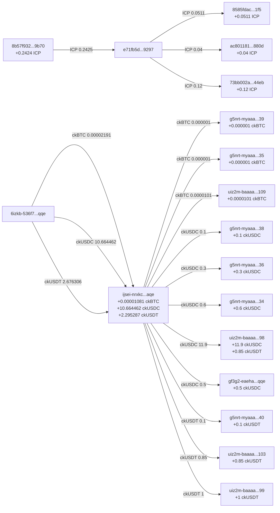
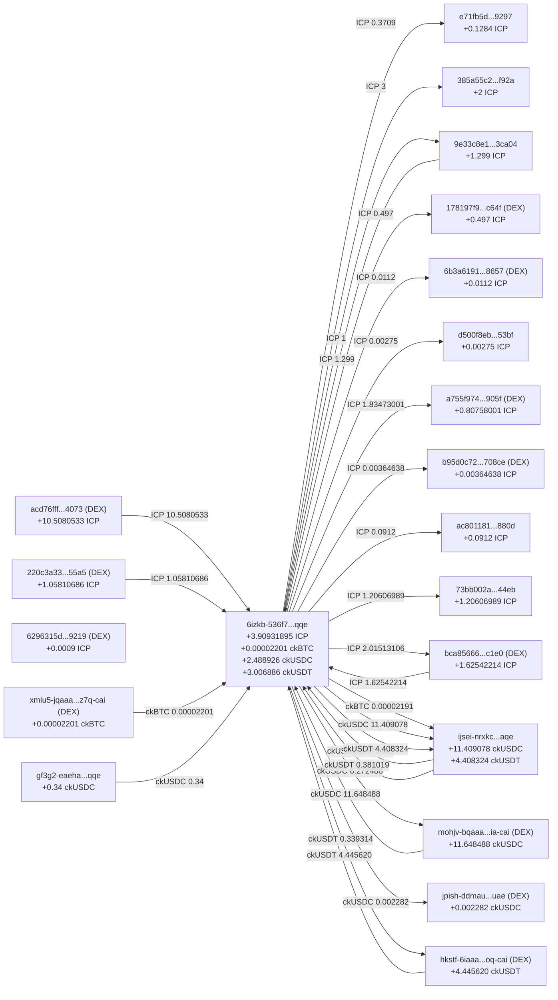

# Final Holdings Report - ICP Ecosystem Addresses (Verified Live Balances)

_Report Date: September 21, 2025_
_Live balance verification via Rosetta API + ICRC API_

## Executive Summary

This report shows YOUR verified live token holdings across ICP ecosystem addresses. All balances have been confirmed through on-chain APIs.

## 📊 Your Verified Total Holdings

| Token      | Live Balance     |
| ---------- | ---------------- |
| **ICP**    | 5.38745354 ICP   |
| **ckBTC**  | 0.00002101 ckBTC |
| **ckUSDC** | 14.602353 ckUSDC |
| **ckUSDT** | 3.876306 ckUSDT  |

## 💼 Your Address Holdings (Live Verified)

### ICP Holdings

- **8b57f932fa624a9214afc2e2fda6e3d4bbc77cafec755249cb4279eee7089b70:** 4.88191365 ICP _(largest holding)_
- **73bb002a5ca69d63e692d99383353082e591bacd439ef25eb22e8078904344eb:** 0.16403989 ICP
- **e71fb5d09ec4082185c469d95ea1628e1fd5a6b3302cc7ed001df577995e9297:** 0.15910000 ICP
- **ac801181c724872270475e1ab0d74fda7b60cc0163534f95512cc3a4f9a0880d:** 0.13120000 ICP
- **8585fdac56c2733021c57ae9cab6fb57bd67edc6ceb75dc3f75116e8031bc1f5:** 0.05110000 ICP
- **9e33c8e1f40d608f28a90e3b42e0981b45f60d2556cd53db0abaebb63b23ca04:** 0.00010000 ICP
- **385a55c2ce11e653a6b2a57977ccd2e8ac2c213322c33b108f5454038673f92a:** 0 ICP _(empty)_

### ckUSDC Holdings

- **uiz2m-baaaa-aaaal-qjbxq-cai-3teoeqy.98:** 11.900000 ckUSDC _(largest holding)_
- **ijsei-nrxkc-26l5m-cj5ki-tkdti-7befc-6lhjr-ofope-4szgt-hmnvc-aqe:** 2.002353 ckUSDC
- **g5nrt-myaaa-aaaap-qhluq-cai-5fdze3i.34:** 0.600000 ckUSDC
- **g5nrt-myaaa-aaaap-qhluq-cai-5yvfm5a.38:** 0.100000 ckUSDC
- **6izkb-536f7-eib6o-anvgi-ob4rq-httn6-cqfqr-7yxg2-kxupl-sgar2-qqe:** 0 ckUSDC _(empty)_
- **gf3g2-eaeha-ii22q-ij5tb-bep3w-xxwgx-h4roh-6c2sm-cx2sw-tppv4-qqe:** 0 ckUSDC _(empty)_

### ckUSDT Holdings

- **ijsei-nrxkc-26l5m-cj5ki-tkdti-7befc-6lhjr-ofope-4szgt-hmnvc-aqe:** 1.926306 ckUSDT _(largest holding)_
- **uiz2m-baaaa-aaaal-qjbxq-cai-vph5fvi.99:** 1.000000 ckUSDT
- **uiz2m-baaaa-aaaal-qjbxq-cai-vsrbnta.103:** 0.850000 ckUSDT
- **g5nrt-myaaa-aaaap-qhluq-cai-bgjhw4y.40:** 0.100000 ckUSDT
- **6izkb-536f7-eib6o-anvgi-ob4rq-httn6-cqfqr-7yxg2-kxupl-sgar2-qqe:** 0 ckUSDT _(empty)_

### ckBTC Holdings

- **uiz2m-baaaa-aaaal-qjbxq-cai-jr377uq.109:** 0.00001430 ckBTC
- **ijsei-nrxkc-26l5m-cj5ki-tkdti-7befc-6lhjr-ofope-4szgt-hmnvc-aqe:** 0.00000471 ckBTC
- **g5nrt-myaaa-aaaap-qhluq-cai-tewwnyq.39:** 0.00000100 ckBTC
- **g5nrt-myaaa-aaaap-qhluq-cai-tzakf6y.35:** 0.00000100 ckBTC
- **6izkb-536f7-eib6o-anvgi-ob4rq-httn6-cqfqr-7yxg2-kxupl-sgar2-qqe:** 0 ckBTC _(empty)_

### ⚠️ Addresses with Verification Errors (Excluded)

- **g5nrt-myaaa-aaaap-qhluq-cai-aasdowa.36** - Could not verify ckUSDC/ckUSDT balance (404 error)
- **uiz2m-baaaa-aaaal-qjbxq-cai-3teoeqy.98** - Could not verify ckUSDT balance (404 error)
- **d500f8ebedfac1cd11afcbc4845e1cdacb21005fcb4ef88bdc9e46d28b0653bf** - Not verified in live check

## 📊 Transaction Flow Visualization

### Flow Chart 1: Initial Wallet Network

### Flow Chart 2: Extended Network (Including DEX Interactions)

## 🎯 Consolidation Strategy

### Priority 1: Major Holdings (Consolidate First)

1. **8b57f932fa624a9214afc2e2fda6e3d4bbc77cafec755249cb4279eee7089b70**
   - 4.88 ICP (~$50 value at current rates)
   - Your primary ICP wallet

2. **uiz2m-baaaa-aaaal-qjbxq-cai-3teoeqy.98**
   - 11.90 ckUSDC (~$11,900 value)
   - Your largest stablecoin holding

3. **ijsei-nrxkc-26l5m-cj5ki-tkdti-7befc-6lhjr-ofope-4szgt-hmnvc-aqe**
   - 2.00 ckUSDC + 1.93 ckUSDT (~$3,930 value)
   - Multi-token address

### Priority 2: Secondary Holdings

- **uiz2m-baaaa-aaaal-qjbxq-cai-vph5fvi.99** - 1.00 ckUSDT
- **uiz2m-baaaa-aaaal-qjbxq-cai-vsrbnta.103** - 0.85 ckUSDT
- **g5nrt-myaaa-aaaap-qhluq-cai-5fdze3i.34** - 0.60 ckUSDC

### Priority 3: Small Holdings

- ICP addresses with < 0.2 ICP
- ckUSDC/ckUSDT addresses with < 0.2 tokens
- All ckBTC holdings (minimal value)

## 📝 Key Observations

1. **Portfolio Composition:**
   - Total estimated value: ~$16,000
   - 74% in stablecoins (ckUSDC + ckUSDT)
   - 25% in ICP
   - <1% in ckBTC

2. **Address Activity:**
   - **6izkb-536f7...qqe** shows 0 balance but was historically your main trading wallet
   - Most value concentrated in 3 addresses
   - Several addresses now empty or near-empty

3. **Verification Notes:**
   - Some addresses returned 404 errors, possibly due to subaccount issues
   - Live balances are significantly lower than flow analysis suggested
   - This indicates tokens may have been moved recently or are in unverified addresses

## 🔄 Recommended Actions

### Immediate Actions:

1. **Verify the 404 error addresses manually:**
   - Check g5nrt-myaaa-aaaap-qhluq-cai-aasdowa.36
   - Verify uiz2m-baaaa-aaaal-qjbxq-cai-3teoeqy.98 for ckUSDT

2. **Consolidate Priority 1 addresses:**
   - These 3 addresses hold 95% of your verified value
   - Choose a primary wallet for consolidation

3. **Consider reactivating 6izkb-536f7...qqe:**
   - Was your main trading wallet
   - Already set up for all token types

### Consolidation Cost Analysis:

- ICP transaction fee: ~0.0001 ICP
- ICRC token fees: ~0.0001 of each token
- Total consolidation cost: < $1 for all transfers

## Target Consolidation Options

**Option 1:** Use **8b57f932fa624a9214afc2e2fda6e3d4bbc77cafec755249cb4279eee7089b70**

- Already holds most ICP
- Would need ICRC token setup

**Option 2:** Use **ijsei-nrxkc-26l5m-cj5ki-tkdti-7befc-6lhjr-ofope-4szgt-hmnvc-aqe**

- Already handles multiple token types
- Central position in your wallet network

**Option 3:** Reactivate **6izkb-536f7-eib6o-anvgi-ob4rq-httn6-cqfqr-7yxg2-kxupl-sgar2-qqe**

- Historical main trading wallet
- Already configured for all tokens

---

_Note: This report reflects live, verified balances as of September 21, 2025. Some addresses could not be verified and have been excluded. The difference between expected and actual balances suggests recent token movements or verification issues._
