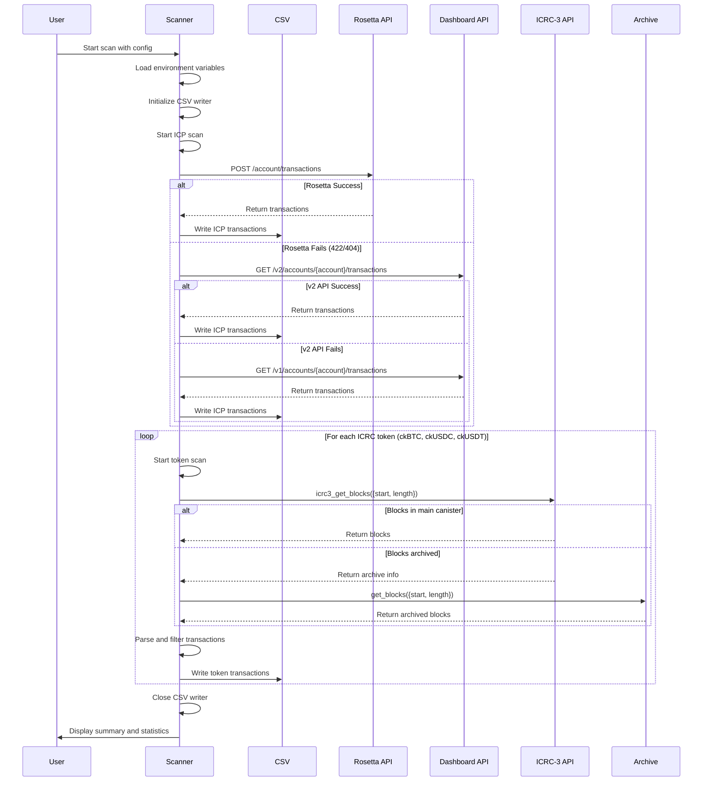
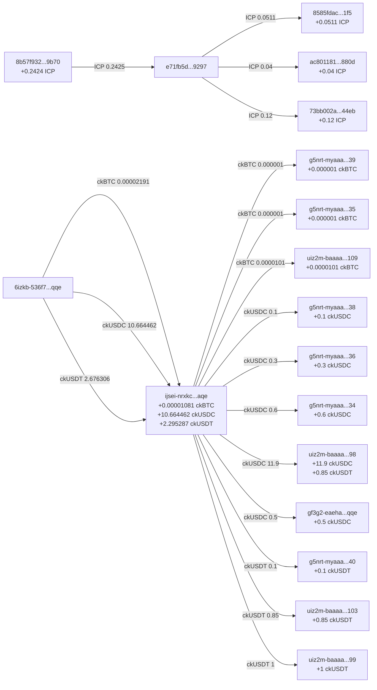

# ICP Transaction Scanner

A unified TypeScript scanner for tracking ICP blockchain transactions across multiple assets:

- ICP (native token)
- ckBTC (chain-key Bitcoin)
- ckUSDC (chain-key USD Coin)
- ckUSDT (chain-key Tether)

## Features

- Unified scanner for both ICP native ledger and ICRC-3 tokens
- Scans historical transactions with full archive support
- Tracks inflows, outflows, self-transfers, mints, and burns
- Exports all transactions to a single CSV file
- Progress tracking during long scans
- Configurable date window for filtering transactions (default: June 1, 2025 to now)
- Supports both principal and legacy account ID matching
- Safe environment variable handling with sensible defaults

## Prerequisites

- Node.js (v16 or higher)
- pnpm (or npm/yarn)

## Installation

```bash
pnpm install
```

## Configuration

All environment variables have safe defaults, so you can run the scanner without any configuration. However, you can customize behavior with these variables:

### Required for Your Wallet

- `WALLET_PRINCIPAL`: Your ICP wallet principal (default: example principal)
- `ICP_ACCOUNT_ID_HEX`: Your ICP account ID in hex format (default: example account)

### Ledger Canister IDs (defaults to mainnet canisters)

- `ICP_LEDGER`: ICP ledger canister ID (default: `ryjl3-tyaaa-aaaaa-aaaba-cai`)
- `CKBTC_LEDGER`: ckBTC ledger canister ID (default: `mxzaz-hqaaa-aaaar-qaada-cai`)
- `CKUSDC_LEDGER`: ckUSDC ledger canister ID (default: `xevnm-gaaaa-aaaar-qafnq-cai`)
- `CKUSDT_LEDGER`: ckUSDT ledger canister ID (default: `cngnf-vqaaa-aaaar-qag4q-cai`)

### Scanning Parameters

- `START_DATE`: Start of time window to scan (default: `2025-06-01T00:00:00Z`)
- `END_DATE`: End of time window to scan (default: current time)
- `MAX_BLOCKS_PER_LEDGER`: Maximum blocks to scan per ledger (default: `1000000`)
- `PAGE`: Page size for block fetching (default: `1000`)
- `PROGRESS_EVERY`: Show progress every N pages (default: `50`)

### Output

- `IC_HOST`: IC network host (default: `https://ic0.app`)
- `OUT_CSV`: Output CSV filename (default: `flows.csv`)

## Usage

### Quick Start (with your wallet)

```bash
# Replace with your actual wallet principal and account ID
WALLET_PRINCIPAL="your-principal-here" \
ICP_ACCOUNT_ID_HEX="your-account-id-hex" \
pnpm start
```

### Build and Run

```bash
# Build the TypeScript
pnpm build

# Run with default settings
pnpm start

# Or run the compiled JS directly
node dist/scanner.js
```

### Example: Scan Specific Date Range

```bash
# Scan transactions between June 1 and September 30, 2025
START_DATE="2025-06-01T00:00:00Z" \
END_DATE="2025-09-30T23:59:59Z" \
WALLET_PRINCIPAL="your-principal" \
ICP_ACCOUNT_ID_HEX="your-account-id" \
pnpm start
```

### Example: Scan Recent Transactions Only

```bash
# Scan only last 10,000 blocks from June 2025 to now
START_DATE="2025-06-01T00:00:00Z" \
MAX_BLOCKS_PER_LEDGER=10000 \
WALLET_PRINCIPAL="your-principal" \
ICP_ACCOUNT_ID_HEX="your-account-id" \
pnpm start
```

### Example: Verbose Progress Output

```bash
# Show progress every 10 pages instead of every 50
PROGRESS_EVERY=10 \
WALLET_PRINCIPAL="your-principal" \
ICP_ACCOUNT_ID_HEX="your-account-id" \
pnpm start
```

### Development Commands

```bash
# Run linting
pnpm lint

# Format code
pnpm format

# Build without running
pnpm build

# Run all checks (lint, format, build)
pnpm check
```

## Output

The scanner generates a CSV file with the following columns:

- `date_iso`: Transaction timestamp in ISO format
- `token`: Token symbol (ICP, ckBTC, ckUSDC, ckUSDT)
- `direction`: Transaction type (inflow, outflow, self, mint, burn)
- `amount`: Formatted amount with proper decimals
- `from_principal`: Sender's principal ID (for ICRC) or account ID (for ICP)
- `from_subaccount`: Sender's subaccount in hex format (empty for default subaccount, blank for ICP)
- `to_principal`: Recipient's principal ID (for ICRC) or account ID (for ICP)
- `to_subaccount`: Recipient's subaccount in hex format (empty for default subaccount, blank for ICP)
- `block_index`: Block number
- `memo`: Transaction memo in hex format

### Example CSV Output

```csv
date_iso,token,direction,amount,from_principal,from_subaccount,to_principal,to_subaccount,block_index,memo
2025-07-23T07:55:03.000Z,ICP,outflow,0.0171,e71fb5d09ec4082185c469d95ea1628e1fd5a6b3302cc7ed001df577995e9297,,8585fdac56c2733021c57ae9cab6fb57bd67edc6ceb75dc3f75116e8031bc1f5,,25906544,
2025-07-17T05:26:17.000Z,ICP,outflow,0.02,e71fb5d09ec4082185c469d95ea1628e1fd5a6b3302cc7ed001df577995e9297,,ac801181c724872270475e1ab0d74fda7b60cc0163534f95512cc3a4f9a0880d,,25719349,
2025-07-14T23:27:19.000Z,ICP,inflow,0.3709,8b57f932fa624a9214afc2e2fda6e3d4bbc77cafec755249cb4279eee7089b70,,e71fb5d09ec4082185c469d95ea1628e1fd5a6b3302cc7ed001df577995e9297,,25652617,
2025-07-23T08:04:18.852Z,ckBTC,outflow,0.000001,ijsei-nrxkc-26l5m-cj5ki-tkdti-7befc-6lhjr-ofope-4szgt-hmnvc-aqe,,g5nrt-myaaa-aaaap-qhluq-cai-tewwnyq.39,0x0000000000000000000000000000000000000000000000000000000000000027,2821412,
2025-07-17T04:18:05.333Z,ckBTC,outflow,0.000001,ijsei-nrxkc-26l5m-cj5ki-tkdti-7befc-6lhjr-ofope-4szgt-hmnvc-aqe,,g5nrt-myaaa-aaaap-qhluq-cai-tzakf6y.35,0x0000000000000000000000000000000000000000000000000000000000000023,2783712,
2025-07-15T04:19:27.155Z,ckBTC,outflow,0.0000031,ijsei-nrxkc-26l5m-cj5ki-tkdti-7befc-6lhjr-ofope-4szgt-hmnvc-aqe,,uiz2m-baaaa-aaaal-qjbxq-cai-jr377uq.109,0x000000000000000000000000000000000000000000000000000000000000006d,2767933,
2025-07-14T23:26:39.567Z,ckBTC,inflow,0.00002191,6izkb-536f7-eib6o-anvgi-ob4rq-httn6-cqfqr-7yxg2-kxupl-sgar2-qqe,,ijsei-nrxkc-26l5m-cj5ki-tkdti-7befc-6lhjr-ofope-4szgt-hmnvc-aqe,,2766063,
2025-07-23T07:16:00.486Z,ckUSDC,outflow,0.1,ijsei-nrxkc-26l5m-cj5ki-tkdti-7befc-6lhjr-ofope-4szgt-hmnvc-aqe,,g5nrt-myaaa-aaaap-qhluq-cai-5yvfm5a.38,0x0000000000000000000000000000000000000000000000000000000000000026,408821,
2025-07-16T10:35:20.174Z,ckUSDC,outflow,0.1,ijsei-nrxkc-26l5m-cj5ki-tkdti-7befc-6lhjr-ofope-4szgt-hmnvc-aqe,,uiz2m-baaaa-aaaal-qjbxq-cai-3teoeqy.98,0x0000000000000000000000000000000000000000000000000000000000000062,402083,
2025-07-14T23:25:37.718Z,ckUSDC,inflow,3.027622,6izkb-536f7-eib6o-anvgi-ob4rq-httn6-cqfqr-7yxg2-kxupl-sgar2-qqe,,ijsei-nrxkc-26l5m-cj5ki-tkdti-7befc-6lhjr-ofope-4szgt-hmnvc-aqe,,400920,
2025-07-23T07:43:04.183Z,ckUSDT,outflow,0.1,ijsei-nrxkc-26l5m-cj5ki-tkdti-7befc-6lhjr-ofope-4szgt-hmnvc-aqe,,g5nrt-myaaa-aaaap-qhluq-cai-bgjhw4y.40,0x0000000000000000000000000000000000000000000000000000000000000028,585442,
2025-07-14T23:27:00.444Z,ckUSDT,inflow,3.026306,6izkb-536f7-eib6o-anvgi-ob4rq-httn6-cqfqr-7yxg2-kxupl-sgar2-qqe,,ijsei-nrxkc-26l5m-cj5ki-tkdti-7befc-6lhjr-ofope-4szgt-hmnvc-aqe,,554863,
```

### Notes on Subaccounts

- **ICRC tokens** (ckBTC, ckUSDC, ckUSDT):
  - `from_principal` and `to_principal` now show human-readable ICRC account format: `<principal>-<tag>.<subaccount>`
  - Subaccount suffixes are shown as decimal numbers for small values (e.g., `.26` for subaccount 26)
  - Large subaccounts are shown in hex format (e.g., `.0xfedcba0987654321`)
  - Default subaccounts (all zeros) are omitted from the principal text
  - Raw hex subaccounts are still available in `from_subaccount` and `to_subaccount` columns
- **ICP transactions**:
  - Shows 64-character hex account identifiers in both principal columns
  - Subaccount fields are always empty because the ICP ledger API only provides account ID hashes
  - These account IDs are one-way hashes of the principal and subaccount, so the original subaccount cannot be recovered

## Technical Details

The scanner implements multiple APIs for comprehensive transaction tracking:

- **ICP Native Token**: Uses Rosetta API as primary method with Dashboard API fallback
- **ICRC Tokens**: Uses ICRC-3 block log standard for ckBTC, ckUSDC, and ckUSDT
- **Archive Support**: Full support for historical data through archive canisters
- **Date Filtering**: Efficiently filters transactions within specified date ranges

## Sequence Diagram



### API Flow Details

1. **ICP Token Scanning**:
   - Primary: Rosetta API for standardized blockchain data
   - Fallback 1: Dashboard API v2 (newer format)
   - Fallback 2: Dashboard API v1 (legacy format)

2. **ICRC Token Scanning**:
   - Uses ICRC-3 standard `icrc3_get_blocks` method
   - Automatically handles archive canister redirects
   - Parses generic Value types for transaction data

3. **Transaction Processing**:
   - Filters by date range (START_DATE to END_DATE)
   - Matches principal or account ID (with optional subaccount)
   - Categorizes as inflow, outflow, self, mint, or burn
   - Formats amounts with proper decimals

## Features Detail

### Multi-API Support

The scanner implements a robust fallback system to ensure maximum compatibility:

- Rosetta API: Industry-standard blockchain API used by many exchanges
- Dashboard APIs: ICP-specific APIs with different response formats
- ICRC-3: Standard interface for token transaction history

### Transaction Classification

- **Inflow**: Tokens received by your wallet
- **Outflow**: Tokens sent from your wallet
- **Self**: Transfers between your own subaccounts
- **Mint**: Token creation events (from minting account)
- **Burn**: Token destruction events (to minting account)

## Scanner Summary

This scanner provides a unified interface for tracking token flows across the ICP ecosystem:

- **ICP Native Token**: Uses Rosetta API (primary) or Dashboard API (fallback)
- **Chain-key Tokens**: Uses ICRC-3 standard for ckBTC, ckUSDC, and ckUSDT
- **Unified Output**: All transactions exported to a single CSV file
- **Performance**: Efficient parallel fetching and streaming CSV writes
- **Reliability**: Multiple API fallbacks ensure maximum uptime

The scanner automatically handles API differences, archive redirects, and various response formats to provide a seamless experience for tracking your ICP ecosystem transactions.

## Transaction Flow Analysis

When you are finished, you can use the CSV to make a cool flow chart like the following:

### Wallet Flow Chart



### Final Wallet Balances (Positive Only)

**ICP Token:**
- `8585fdac56c2733021c57ae9cab6fb57bd67edc6ceb75dc3f75116e8031bc1f5`: **+0.0511 ICP**
- `ac801181c724872270475e1ab0d74fda7b60cc0163534f95512cc3a4f9a0880d`: **+0.04 ICP**
- `73bb002a5ca69d63e692d99383353082e591bacd439ef25eb22e8078904344eb`: **+0.12 ICP**
- `8b57f932fa624a9214afc2e2fda6e3d4bbc77cafec755249cb4279eee7089b70`: **+0.2424 ICP**

**ckBTC Token:**
- `ijsei-nrxkc-26l5m-cj5ki-tkdti-7befc-6lhjr-ofope-4szgt-hmnvc-aqe`: **+0.00001081 ckBTC**
- `g5nrt-myaaa-aaaap-qhluq-cai-tewwnyq.39`: **+0.000001 ckBTC**
- `g5nrt-myaaa-aaaap-qhluq-cai-tzakf6y.35`: **+0.000001 ckBTC**
- `uiz2m-baaaa-aaaal-qjbxq-cai-jr377uq.109`: **+0.0000101 ckBTC**

**ckUSDC Token:**
- `ijsei-nrxkc-26l5m-cj5ki-tkdti-7befc-6lhjr-ofope-4szgt-hmnvc-aqe`: **+10.664462 ckUSDC**
- `g5nrt-myaaa-aaaap-qhluq-cai-5yvfm5a.38`: **+0.1 ckUSDC**
- `g5nrt-myaaa-aaaap-qhluq-cai-aasdowa.36`: **+0.3 ckUSDC**
- `g5nrt-myaaa-aaaap-qhluq-cai-5fdze3i.34`: **+0.6 ckUSDC**
- `uiz2m-baaaa-aaaal-qjbxq-cai-3teoeqy.98`: **+11.9 ckUSDC**
- `gf3g2-eaeha-ii22q-ij5tb-bep3w-xxwgx-h4roh-6c2sm-cx2sw-tppv4-qqe`: **+0.5 ckUSDC**

**ckUSDT Token:**
- `ijsei-nrxkc-26l5m-cj5ki-tkdti-7befc-6lhjr-ofope-4szgt-hmnvc-aqe`: **+2.295287 ckUSDT**
- `g5nrt-myaaa-aaaap-qhluq-cai-bgjhw4y.40`: **+0.1 ckUSDT**
- `uiz2m-baaaa-aaaal-qjbxq-cai-vsrbnta.103`: **+0.85 ckUSDT**
- `uiz2m-baaaa-aaaal-qjbxq-cai-vph5fvi.99`: **+1 ckUSDT**
