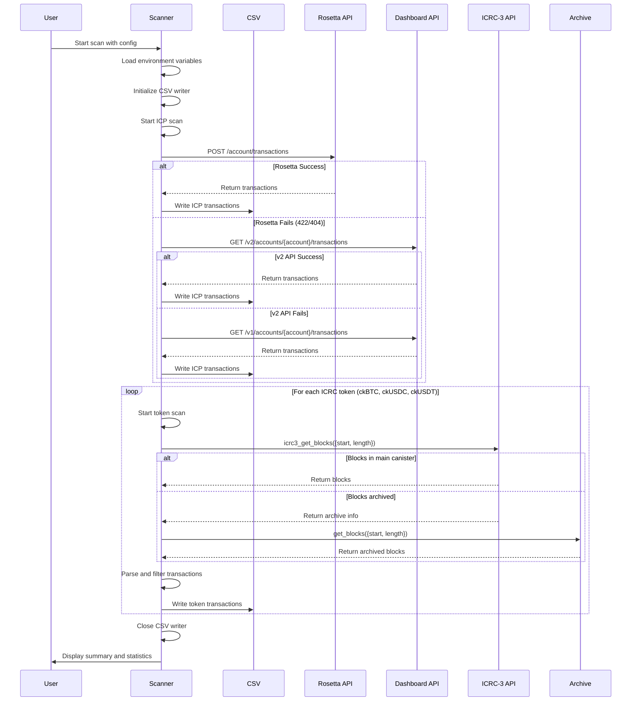

# ICP Transaction Scanner

A unified TypeScript scanner for tracking ICP blockchain transactions across multiple assets:

- ICP (native token)
- ckBTC (chain-key Bitcoin)
- ckUSDC (chain-key USD Coin)
- ckUSDT (chain-key Tether)

## Features

- Unified scanner for both ICP native ledger and ICRC-3 tokens
- Scans historical transactions with full archive support
- Tracks inflows, outflows, self-transfers, mints, and burns
- Exports all transactions to a single CSV file
- Progress tracking during long scans
- Configurable date window for filtering transactions (default: June 1, 2025 to now)
- Supports both principal and legacy account ID matching
- Safe environment variable handling with sensible defaults

## Prerequisites

- Node.js (v16 or higher)
- pnpm (or npm/yarn)

## Installation

```bash
pnpm install
```

## Configuration

All environment variables have safe defaults, so you can run the scanner without any configuration. However, you can customize behavior with these variables:

### Required for Your Wallet

- `WALLET_PRINCIPAL`: Your ICP wallet principal (default: example principal)
- `ICP_ACCOUNT_ID_HEX`: Your ICP account ID in hex format (default: example account)

### Ledger Canister IDs (defaults to mainnet canisters)

- `ICP_LEDGER`: ICP ledger canister ID (default: `ryjl3-tyaaa-aaaaa-aaaba-cai`)
- `CKBTC_LEDGER`: ckBTC ledger canister ID (default: `mxzaz-hqaaa-aaaar-qaada-cai`)
- `CKUSDC_LEDGER`: ckUSDC ledger canister ID (default: `xevnm-gaaaa-aaaar-qafnq-cai`)
- `CKUSDT_LEDGER`: ckUSDT ledger canister ID (default: `cngnf-vqaaa-aaaar-qag4q-cai`)

### Scanning Parameters

- `START_DATE`: Start of time window to scan (default: `2025-06-01T00:00:00Z`)
- `END_DATE`: End of time window to scan (default: current time)
- `MAX_BLOCKS_PER_LEDGER`: Maximum blocks to scan per ledger (default: `1000000`)
- `PAGE`: Page size for block fetching (default: `1000`)
- `PROGRESS_EVERY`: Show progress every N pages (default: `50`)

### Output

- `IC_HOST`: IC network host (default: `https://ic0.app`)
- `OUT_CSV`: Output CSV filename (default: `flows.csv`)

## Usage

### Quick Start (with your wallet)

```bash
# Replace with your actual wallet principal and account ID
WALLET_PRINCIPAL="your-principal-here" \
ICP_ACCOUNT_ID_HEX="your-account-id-hex" \
pnpm start
```

### Build and Run

```bash
# Build the TypeScript
pnpm build

# Run with default settings
pnpm start

# Or run the compiled JS directly
node dist/scanner.js
```

### Example: Scan Specific Date Range

```bash
# Scan transactions between June 1 and September 30, 2025
START_DATE="2025-06-01T00:00:00Z" \
END_DATE="2025-09-30T23:59:59Z" \
WALLET_PRINCIPAL="your-principal" \
ICP_ACCOUNT_ID_HEX="your-account-id" \
pnpm start
```

### Example: Scan Recent Transactions Only

```bash
# Scan only last 10,000 blocks from June 2025 to now
START_DATE="2025-06-01T00:00:00Z" \
MAX_BLOCKS_PER_LEDGER=10000 \
WALLET_PRINCIPAL="your-principal" \
ICP_ACCOUNT_ID_HEX="your-account-id" \
pnpm start
```

### Example: Verbose Progress Output

```bash
# Show progress every 10 pages instead of every 50
PROGRESS_EVERY=10 \
WALLET_PRINCIPAL="your-principal" \
ICP_ACCOUNT_ID_HEX="your-account-id" \
pnpm start
```

### Development Commands

```bash
# Run linting
pnpm lint

# Format code
pnpm format

# Build without running
pnpm build

# Run all checks (lint, format, build)
pnpm check
```

## Output

The scanner generates a CSV file with the following columns:

- `date_iso`: Transaction timestamp in ISO format
- `token`: Token symbol (ICP, ckBTC, ckUSDC, ckUSDT)
- `direction`: Transaction type (inflow, outflow, self, mint, burn)
- `amount`: Formatted amount with proper decimals
- `from_principal`: Sender's principal ID
- `to_principal`: Recipient's principal ID
- `block_index`: Block number
- `memo`: Transaction memo in hex format

### Example CSV Output

```csv
date_iso,token,direction,amount,from_principal,to_principal,block_index,memo
2025-11-25T07:36:36.103Z,ICP,outflow,0.05,ijsei-nrxkc-26l5m-cj5ki-tkdti-7befc-6lhjr-ofope-4szgt-hmnvc-aqe,6x3fv-2ddto-ik4gh-i2l2s-z62hn-5eeb2-xosoo-5yfhr-2xqv5-mqxkr-7qe,28370763,
2025-11-24T15:18:31.816Z,ICP,outflow,0.00010000,ijsei-nrxkc-26l5m-cj5ki-tkdti-7befc-6lhjr-ofope-4szgt-hmnvc-aqe,7hfb6-caaaa-aaaar-qadga-cai,28357447,
2025-11-17T09:47:33.313Z,ICP,inflow,0.01,2vxsx-fae,ijsei-nrxkc-26l5m-cj5ki-tkdti-7befc-6lhjr-ofope-4szgt-hmnvc-aqe,28125451,c8995b010000000000080013,
2025-11-16T10:51:45.593Z,ICP,inflow,2.25000000,v3e4c-4aaaa-aaaah-afaaa-cai,ijsei-nrxkc-26l5m-cj5ki-tkdti-7befc-6lhjr-ofope-4szgt-hmnvc-aqe,28098523,
2025-10-29T15:56:55.058Z,ICP,outflow,0.00010000,ijsei-nrxkc-26l5m-cj5ki-tkdti-7befc-6lhjr-ofope-4szgt-hmnvc-aqe,nns7d-5qaaa-aaaan-qitja-cai,27552802,
2025-10-25T18:14:48.577Z,ICP,outflow,0.00010000,ijsei-nrxkc-26l5m-cj5ki-tkdti-7befc-6lhjr-ofope-4szgt-hmnvc-aqe,mxzaz-hqaaa-aaaar-qaada-cai,27428451,
2025-10-17T06:27:55.426Z,ckBTC,outflow,0.00006152,ijsei-nrxkc-26l5m-cj5ki-tkdti-7befc-6lhjr-ofope-4szgt-hmnvc-aqe,mxzaz-hqaaa-aaaar-qaada-cai,2829644,
2025-10-17T06:25:44.476Z,ckBTC,inflow,0.00008334,ns3jx-qyaaa-aaaar-qadbq-cai,ijsei-nrxkc-26l5m-cj5ki-tkdti-7befc-6lhjr-ofope-4szgt-hmnvc-aqe,2829627,
2025-09-30T06:18:27.000Z,ckBTC,outflow,0.00001000,ijsei-nrxkc-26l5m-cj5ki-tkdti-7befc-6lhjr-ofope-4szgt-hmnvc-aqe,mxzaz-hqaaa-aaaar-qaada-cai,2819641,
2025-09-30T06:13:44.000Z,ckBTC,inflow,0.00001061,ns3jx-qyaaa-aaaar-qadbq-cai,ijsei-nrxkc-26l5m-cj5ki-tkdti-7befc-6lhjr-ofope-4szgt-hmnvc-aqe,2819638,
2025-09-26T10:42:39.000Z,ckBTC,outflow,0.00001000,ijsei-nrxkc-26l5m-cj5ki-tkdti-7befc-6lhjr-ofope-4szgt-hmnvc-aqe,mxzaz-hqaaa-aaaar-qaada-cai,2817468,
2025-09-26T10:41:09.000Z,ckBTC,inflow,0.00004018,ns3jx-qyaaa-aaaar-qadbq-cai,ijsei-nrxkc-26l5m-cj5ki-tkdti-7befc-6lhjr-ofope-4szgt-hmnvc-aqe,2817467,
```

## Technical Details

The scanner implements multiple APIs for comprehensive transaction tracking:

- **ICP Native Token**: Uses Rosetta API as primary method with Dashboard API fallback
- **ICRC Tokens**: Uses ICRC-3 block log standard for ckBTC, ckUSDC, and ckUSDT
- **Archive Support**: Full support for historical data through archive canisters
- **Date Filtering**: Efficiently filters transactions within specified date ranges

## Sequence Diagram



### API Flow Details

1. **ICP Token Scanning**:
   - Primary: Rosetta API for standardized blockchain data
   - Fallback 1: Dashboard API v2 (newer format)
   - Fallback 2: Dashboard API v1 (legacy format)

2. **ICRC Token Scanning**:
   - Uses ICRC-3 standard `icrc3_get_blocks` method
   - Automatically handles archive canister redirects
   - Parses generic Value types for transaction data

3. **Transaction Processing**:
   - Filters by date range (START_DATE to END_DATE)
   - Matches principal or account ID (with optional subaccount)
   - Categorizes as inflow, outflow, self, mint, or burn
   - Formats amounts with proper decimals

## Features Detail

### Multi-API Support

The scanner implements a robust fallback system to ensure maximum compatibility:

- Rosetta API: Industry-standard blockchain API used by many exchanges
- Dashboard APIs: ICP-specific APIs with different response formats
- ICRC-3: Standard interface for token transaction history

### Transaction Classification

- **Inflow**: Tokens received by your wallet
- **Outflow**: Tokens sent from your wallet
- **Self**: Transfers between your own subaccounts
- **Mint**: Token creation events (from minting account)
- **Burn**: Token destruction events (to minting account)

## Scanner Summary

This scanner provides a unified interface for tracking token flows across the ICP ecosystem:

- **ICP Native Token**: Uses Rosetta API (primary) or Dashboard API (fallback)
- **Chain-key Tokens**: Uses ICRC-3 standard for ckBTC, ckUSDC, and ckUSDT
- **Unified Output**: All transactions exported to a single CSV file
- **Performance**: Efficient parallel fetching and streaming CSV writes
- **Reliability**: Multiple API fallbacks ensure maximum uptime

The scanner automatically handles API differences, archive redirects, and various response formats to provide a seamless experience for tracking your ICP ecosystem transactions.
